# ✨ **SSYCLR: Minimalist Clothing E-Commerce Platform**  
> _"Redefining shopping for minimalist fashion with technology and simplicity."_  

Welcome to **SSYCLR**, a fully functional and thoughtfully crafted e-commerce platform tailored for a minimalist clothing brand. This repository houses the entire source code, documentation, and setup instructions for a modern e-commerce application, designed to provide a seamless shopping experience and clean, scalable architecture for future enhancements.

[](https://ssyclr.netlify.app/)  
[](https://github.com/Hailex798/SSYCLR_ECommerce-Clothing-Store)  

---

## 🏁 **Introduction**

SSYCLR is more than just an e-commerce platform—it's a **modern user-first web application** built to showcase a brand's unique identity while offering robust features that simplify online shopping. The application is crafted with **scalability** and **efficiency** in mind, incorporating advanced filtering, secure user authentication, and a cart that persists data intelligently for an uninterrupted user experience.  

---

## 🎨 **Visual Overview**

Below are visual previews of the application’s various pages and features. Click on the dropdown arrows to view the corresponding screenshots.

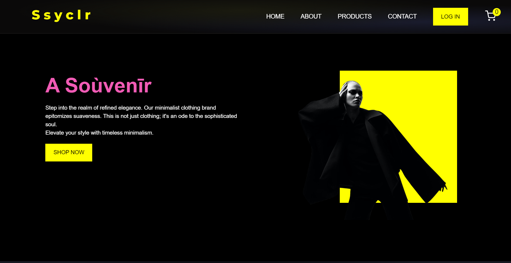
---
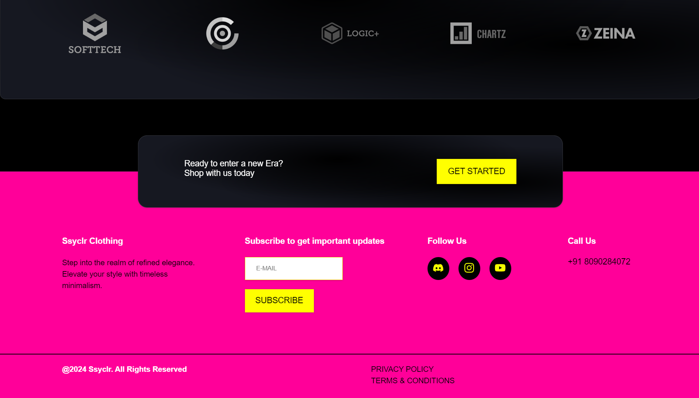

<details>
  <summary>🏠 <strong>Home Page</strong> (Click to Expand)</summary>

  - An elegant landing page introducing the brand.  
  - Clear navigation and a minimalist design to captivate users.

  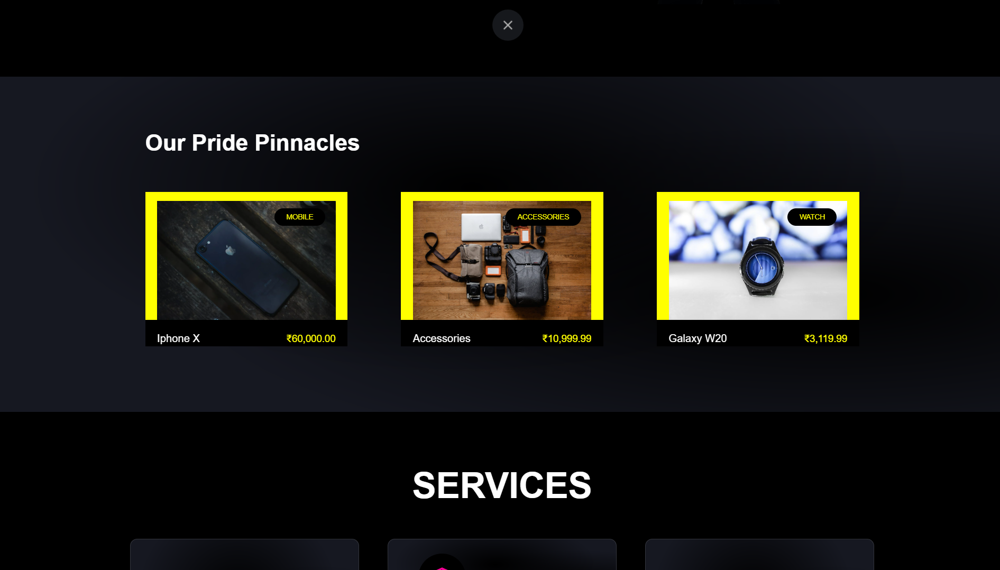
  ---
  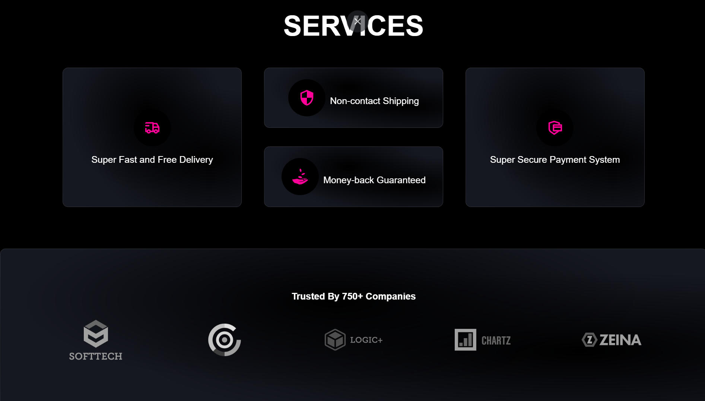

</details>

<details>
  <summary>👕 <strong>About Us & Contact Section</strong> (Click to Expand)</summary>

  - Learn more about the brand's vision and mission.  
  - A dedicated page to get in touch with the company's team & store's location.

  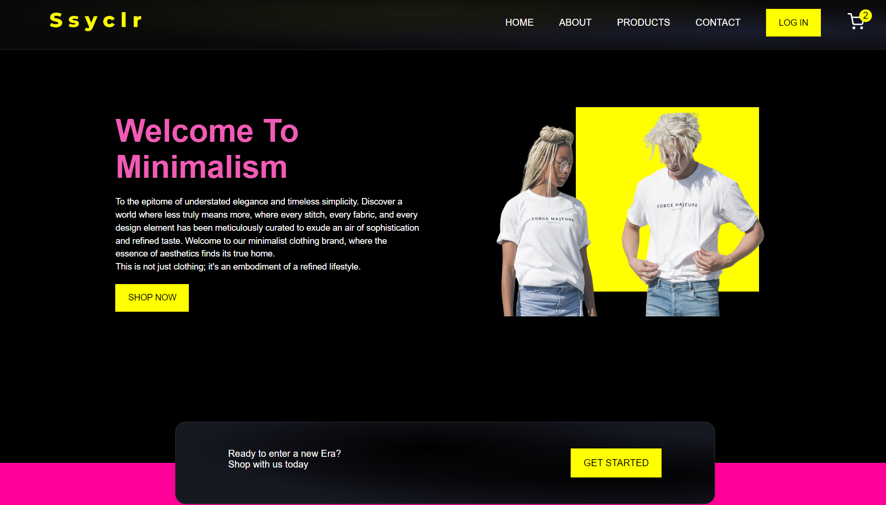
  ---
  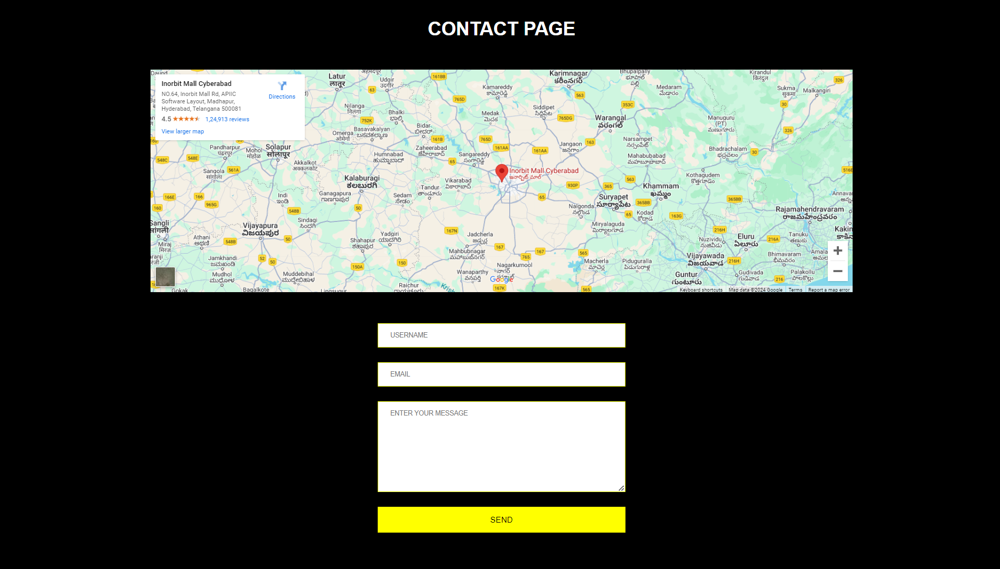

</details>

<details>
  <summary>👕 <strong>Product Page</strong> (Click to Expand)</summary>

  - Dynamic product grid with advanced filtering options.  
  - Intuitive design for enhanced shopping experience.

  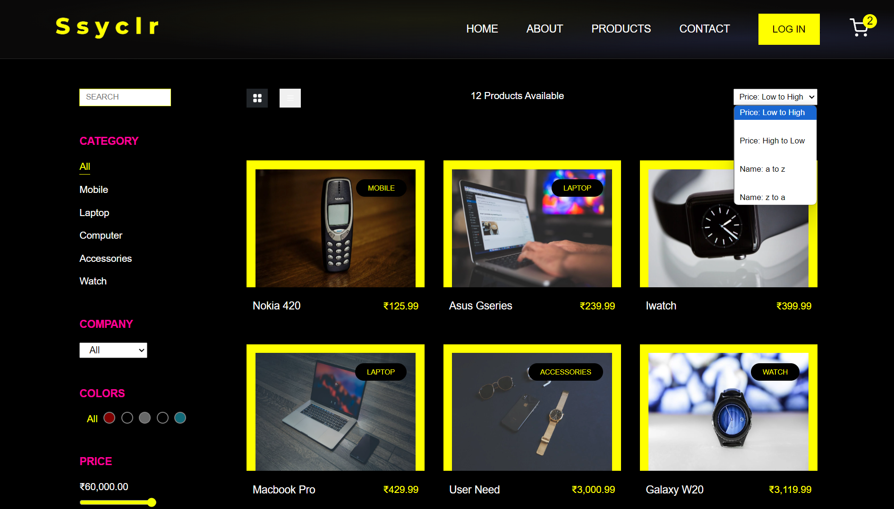
  ---
  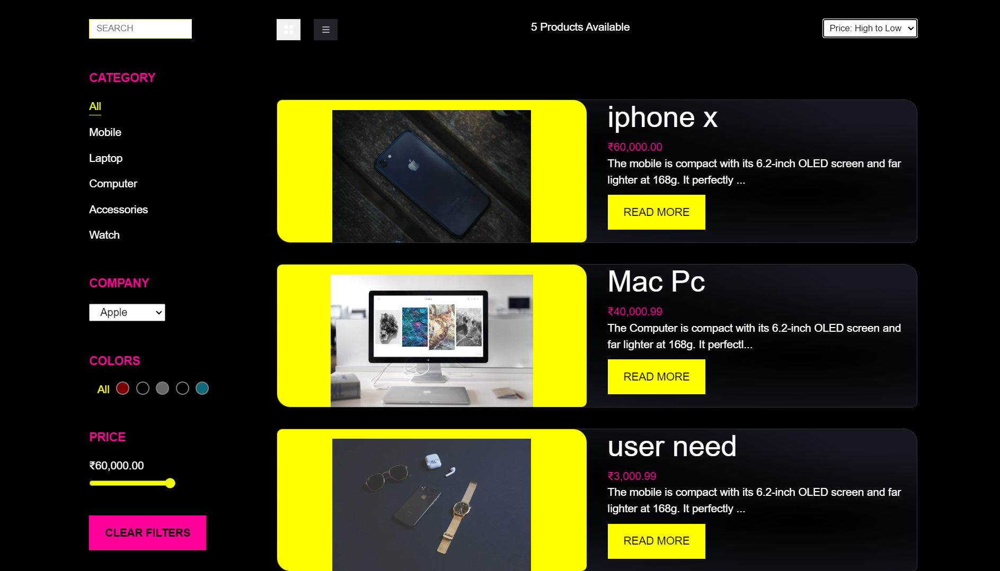
  ---
  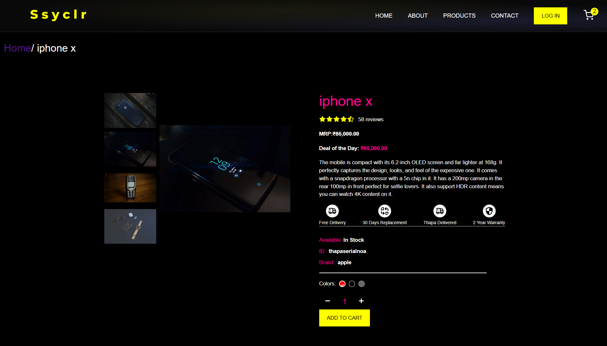

</details>

<details>
  <summary>🛒 <strong>Cart</strong> (Click to Expand)</summary>

  - Manage selected items with real-time updates and price calculations.  
  - Minimalist design ensuring ease of use.

  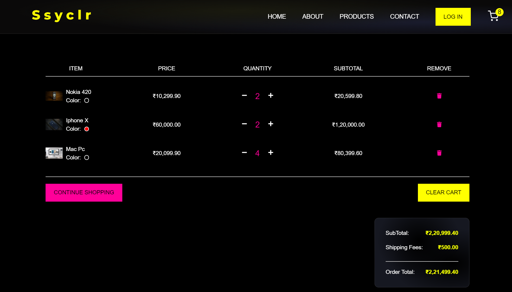
  ---
  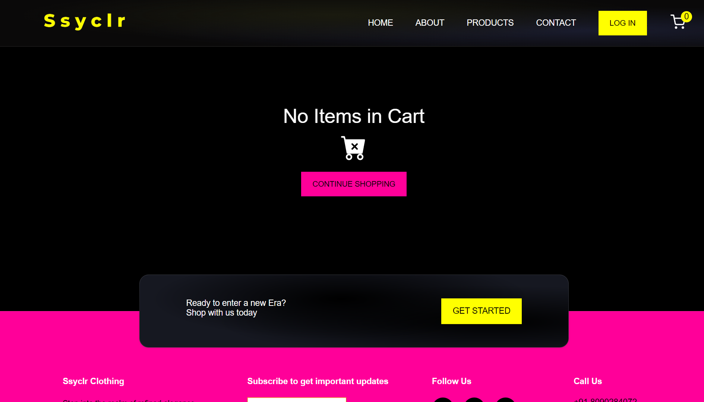

</details>

<details>
  <summary>🔒 <strong>Authentication Flow</strong> (Click to Expand)</summary>

  - Secure Firebase Auth0 login with Google and email integration.  
  - Personalized experience post-login.

  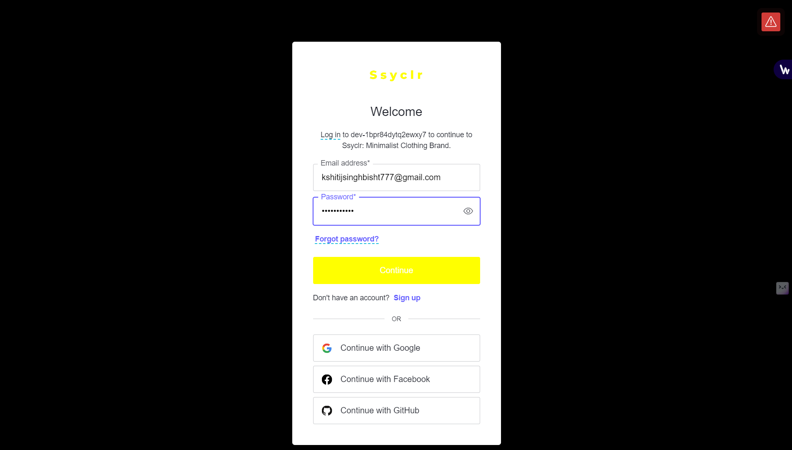
  ---
  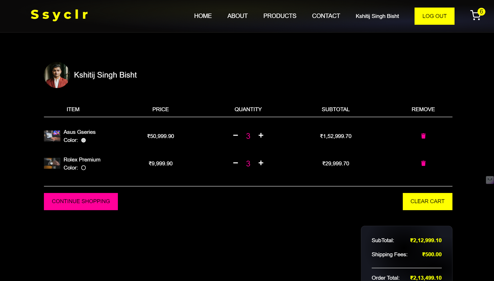

</details>
*Visit the [Live Site](https://ssyclr.netlify.app/) for a full experience!* 🌐

---

## ✨ **Core Features**

### 🔍 **Minimalist User Interface**  
- Designed with simplicity and clarity to enhance usability while maintaining brand focus.
- Fully responsive design for seamless usage across devices.

### 🛒 **Shopping Features**  
1. **Product Listing**: Dynamic rendering of products fetched via APIs.  
2. **Filtering Options**:  
   - By **company**, **color**, and **price range**.  
   - One-click **reset filter** functionality for ease of navigation.  
3. **Product Details Page**:  
   - **Left Panel**: Interactive product image gallery.  
   - **Right Panel**: Detailed descriptions, features, pricing, and customization options.  
   - Add-to-cart functionality with quantity and color selectors.

### 🔒 **Authentication**  
- Secure **OAuth-based login** via Firebase Auth0 (Google, email, and more).  
- Authenticated users get access to personalized profiles.

### 🚀 **Advanced Cart Management**  
- Persistent cart stored in **local storage**, ensuring no data loss on page reload.  
- Real-time cart updates, final price calculations, and a "Continue Shopping" option.  

---

## 🌍 **Live Application**

Experience the live version here:  
🔗 [**SSYCLR Live Website**](https://ssyclr.netlify.app/)  

---

## 💻 **Tech Stack**

This project leverages modern web development technologies and tools to ensure optimal performance and developer efficiency:

| **Category**           | **Tech**                                 |
|-------------------------|------------------------------------------|
| Frontend Framework      | React.js                                |
| Build Tool              | Vite                                    |
| Authentication          | Firebase Auth0                          |
| State Management        | React Context API                       |
| Deployment              | Netlify                                 |
| Data Storage (Local)    | Local Storage (Browser-based)           |
| Future Potential Stack  | MongoDB, Express.js, Node.js (Full MERN)|

---

## 📚 **Installation and Setup**

To run SSYCLR locally, follow these step-by-step instructions:  

### Prerequisites  
Ensure the following are installed on your system:
- **Node.js (v16 or later)**  
- **npm (v8 or later)**  

### 1️⃣ Clone the Repository  
```bash
git clone https://github.com/Hailex798/SSYCLR_Ecommerce-Clothing-Store.git
cd SSYCLR_ECommerce-Clothing-Store
```

### 2️⃣ Install Dependencies  
```bash
npm install
```

### 3️⃣ Start the Development Server  
```bash
npm start
```

### 4️⃣ View the Application  
Open your browser and navigate to:  
**[http://localhost:3000](http://localhost:3000)**  

---

## 🌟 **Architecture Overview**

The architecture of SSYCLR has been carefully designed for scalability, modularity, and maintainability. Below is a high-level overview:

1. **Component-Based Design**:  
   All features and UI elements are implemented as reusable React components, enabling rapid development and consistent design.  

2. **State Management**:  
   Global state is handled using **Context API**, minimizing prop drilling while ensuring efficient data flow across components.

3. **Authentication Layer**:  
   Firebase Auth0 is used to manage secure and scalable OAuth-based user login, including token-based authentication.

4. **Persistent Storage**:  
   The cart is persisted in **local storage**, ensuring user actions are not lost due to page reloads or browser closures.

5. **APIs**:  
   All product data is fetched dynamically via APIs, allowing for integration with real-world product catalogs.

---

## 📈 **Future Scope and Enhancements**

The platform has been designed with future improvements in mind. Below are some potential additions:

1. **Payment Gateway Integration**:  
   Incorporate payment solutions like Stripe or PayPal for order processing.  

2. **Order History and Tracking**:  
   Enable users to view and track past purchases.  

3. **Database Integration**:  
   Replace local storage with **MongoDB** or another NoSQL database for persistent and secure storage.  

4. **Full-Stack Transition**:  
   Upgrade the platform to a **MERN stack** (MongoDB, Express.js, React.js, Node.js) for a complete full-stack experience.

5. **Wishlist Functionality**:  
   Allow users to save products for later purchases.

---

## 🤝 **Contributing**

We welcome contributions from the community! If you have ideas for improvements or find a bug, feel free to contribute:  

1. **Fork this repository**.  
2. **Create a new branch** for your feature or bug fix:  
   ```bash
   git checkout -b feature-name
   ```
3. **Make your changes** and commit them:  
   ```bash
   git commit -m "Description of changes"
   ```
4. **Push to your branch** and open a pull request.

---

## 📜 **License**

This project is licensed under the **MIT License**. See the `LICENSE` file for details.

---

## 🌟 **Acknowledgments**

Special thanks to the **React**, **Vite**, and **Firebase** communities for providing robust tools and libraries to build modern web applications.  

> Created with ❤️ by [Hailex798](https://github.com/Hailex798).  
```
